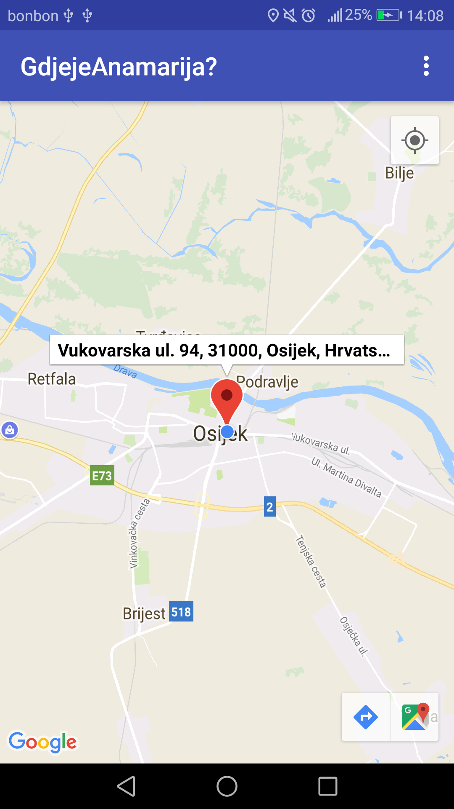
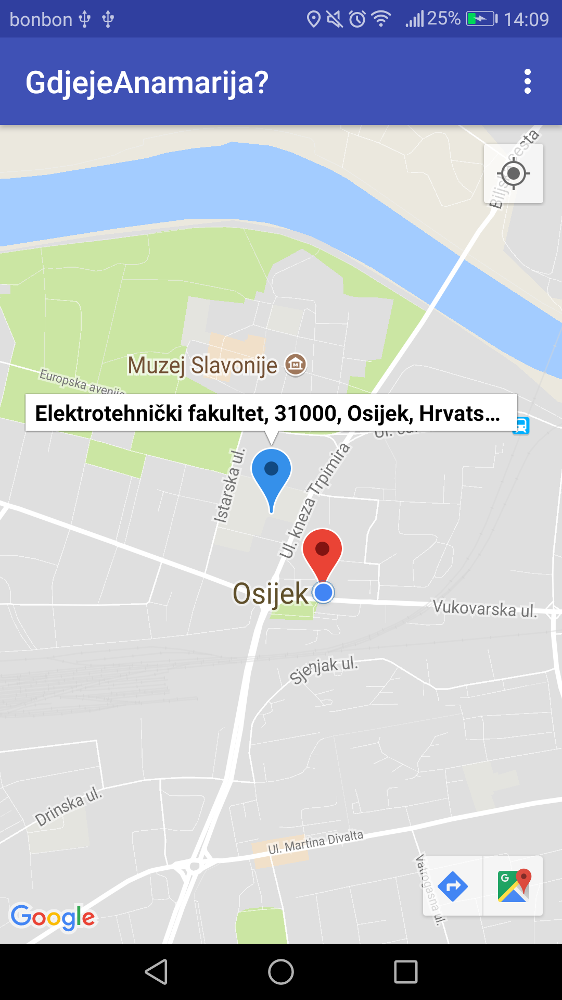
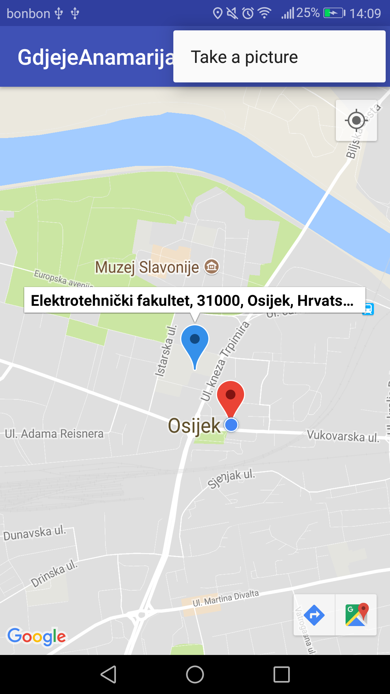
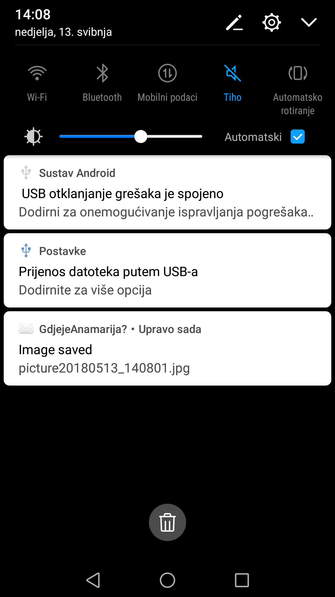

# RMA - DZ5

### The assignment and problems encountered

The assignment was to create an application which shows the location of the user using GPS. On the current location is a marker showing the details of the current address and a marker can be put anywhere on the map by clicking the map. Also, by putting the marker on the map it will produce a sound and by cliking the marker, details will be shown about the location. It also has the ability to take pictures and save them to the gallery. When a picture is saved, a notification is sent to the user. 

For easier understanding and implementation the following links were used: 
* [Google Developers - Camera](https://developer.android.com/training/camera/photobasics)

* [Google Developers - Maps](https://developers.google.com/maps/documentation/android-sdk/intro)

### Utilised snippets/solutions/libraries/SO answers

* Permissions
```xml
<uses-permission android:name="android.permission.ACCESS_FINE_LOCATION"/>
<uses-feature android:name="android.hardware.camera"
    android:required="true" />
<uses-permission android:name="android.permission.WRITE_EXTERNAL_STORAGE"/>
<uses-permission android:name="android.permission.CAMERA"/>
```

* Manifest - FileProvider
```xml 
<meta-data android:name="com.google.android.gms.version" android:value="@integer/google_play_services_version" />

<meta-data android:name="com.google.android.geo.API_KEY"
android:value="@string/google_maps_key" />

<provider android:name="android.support.v4.content.FileProvider"
android:authorities="com.ferit.ablavicki.gdjejeanamarija.provider"
android:exported="false"
android:grantUriPermissions="true">
<meta-data
android:name="android.support.FILE_PROVIDER_PATHS"
android:resource="@xml/path"></meta-data>
</provider>   
```

* Play services 
```gradle 
implementation 'com.google.android.gms:play-services-location:15.0.1'

implementation 'com.google.android.gms:play-services-maps:15.0.1'

implementation 'com.google.android.gms:play-services-places:15.0.1
 ```

### Screenshots

<p align="middle">



<br>
